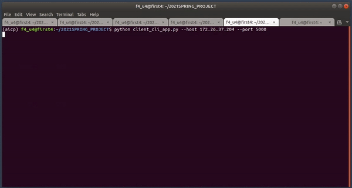

# Ask rather than Guess: User-in-the-loop Gender-coreference Fair Translation

This is an implementation of a personal project named "Ask rather than Guess". The project aims to remove gender bias in coreference, which is an output from a neural machine translation system.

Resulting CLI application works as below:




## How to use
1. First, you need to run a hosting server:
```
python server_app.py --GPU_ID {GPU_ID} --host {HOST_IP} --translation_api {CHOOSE: naver, kakao, google}
```
2. Then, you can run a CLI application:
```
python client_cli_app.py --host {HOST_IP} --port 5000
```


## Pipeline
The full pipeline of the system looks like below:


## BERT Fine-tuning Results

